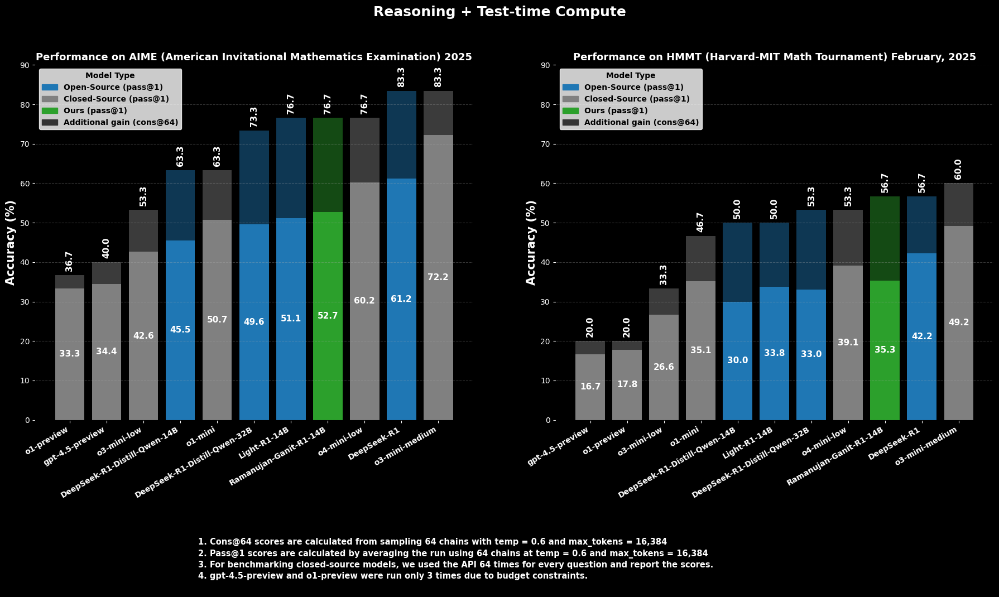

# Ramanujan-Ganit‑R1-14B-V1

        

## Overview

**Ramanujan-Ganit-R1-14B-V1** is a 14-billion parameter language model fine-tuned for **mathematical reasoning** using a multi-stage pipeline that emphasizes **accuracy**, **conciseness**, and **robustness** across varying levels of problem difficulty.

---

## 🧮 Data Collection and Preprocessing

Our journey begins by curating a high-quality mathematical corpus from several open-source datasets:

- **Open-R1**
- **Light-R1**
- **Numina – Olympiads & AOPS_forum**
- **II-Thoughts**
- **OMNI-math**

After rigorous deduplication and decontamination, we consolidated approximately **100,000 unique problems**, forming the foundation for all subsequent training stages.

---

## 📊 Estimating Problem Difficulty and Response Quality

To facilitate informed data curation, we utilize the **R1-Distill-14B** model to sample multiple response chains per question. We define the **solve rate** as the fraction of chains that reach the correct answer. This solve rate acts as a proxy for **problem difficulty** and acts as a useful metric for **data selection** during various training stages.

---

## 🧠 Training Pipeline

### 🔹 Stage 1: Reinforcement Learning 

In the first training phase, we aim to instill the model with a preference for **brevity** without compromising **correctness**. We recalculate the **solve rates** under a budget constraint of **6,000-tokens**. Questions whose **new solve rates** fall between **0.0 and 0.5** are retained . This subset forms the **RL Compression dataset**.

Starting from the **R1-Distill-14B** , we train the model using **GRPO** algorithm with a **objective**: reward shorter chains that have reached the correct answer. This **compression-centric** approach teaches the model to preserve only the most **essential inference steps**, laying the groundwork for **efficient reasoning** in resource-constrained settings.

---

### 🔹 Stage 2: Supervised Fine-Tuning 

Building upon the RL checkpoint from **Stage 1**, we next train the model to elaborate its reasoning, which is particularly necessary for solving more difficult problems. We apply filtering where Questions with solve rate between **0.1** and **0.4** are retained. Again, using multiple sampled responses from the **R1-distill-14B** model, we identify all **correct response chains** and select the **shortest correct chain per question** to form the **SFT Shortest Chains dataset**.

These shortest correct chains serve as ideal demonstrations of **minimal yet sufficient reasoning**. Through **supervised fine-tuning**, the model learns to explain its reasoning in a more **precise and efficient** manner — elaborating only when necessary and avoiding **redundant or tangential steps**. This results in a model capable of **clear and concise mathematical reasoning**.
We name this model **Ramanujan-Ganit-R1-14B-V0.4**

---

### 🔹 Stage 3: SFT with Curriculum Learning 

Finally, we train another model focused on improving the model’s performance on **hard problems**. Using the **93K Open-R1 dataset**, we annotate question difficulty on a scale from **1 to 10** using **OpenAI's o3mini**. We retain questions rated **5 or above**, and further filter them by **solve rates between 0.2 and 0.6**, as estimated from multiple **14B model** responses.This filtered subset becomes the **Curriculum Learning dataset**. 

We perform supervised fine-tuning (SFT) on top of the **R1-Distill-14B**, using a **curriculum schedule** where, within each epoch, the model encounters questions in order of increasing difficulty — starting from easier ones and gradually progressing to harder problems. This **scaffolding** allows the model to build confidence on **moderately difficult questions** before confronting more **complex math problems**, reducing the risk of **early overfitting** and improving overall **robustness**.
We name this model **Ramanujan-Ganit-R1-14B-V0.6**

---

## 🧩 Final Integration: Ramanujan-Ganit-R1-14B-V1

The final model, **Ramanujan-Ganit-R1-14B-V1**, is obtained by **merging** the 2 resultant models from the aforementioned training stages:

- **Ramanujan-Ganit-R1-14B-V0.4 (RL + SFT)** contributes the ability to generate efficient, well-articulated reasoning chains that are as brief as they are correct.
- **Ramanujan-Ganit-R1-14B-V0.6 (Curriculum SFT)** enhances resilience on difficult problems and promotes stepwise learning across complexity levels.

By combining these capabilities, **Ramanujan-Ganit-R1-14B-V1** maximizes its potential of solving highly complicated math problems accurately, while simultaneously offering a **concise explanation** for the same.

---

## Evaluation

We evaluate Ramanujan-Ganit‑R1-14B-V1 using the same metrics and sampling configuration introduced in the DeepSeek‑R1 paper, namely **pass@1** and **cons@64**. However, our evaluation is conducted under a reduced context window of 16,384 tokens, compared to DeepSeek‑R1’s 32,768 tokens, to better reflect practical deployment constraints.

- **pass@1**: Measures the fraction of problems correctly solved in the first generated sample.
- **cons@64**: Assesses consistency by sampling 64 reasoning chains per question and computing the majority vote accuracy.

**Evaluation Configuration**:

- Temperature: 0.6  
- top_p: 0.95  
- Number of sampled chains: 64  
- Context window: 16,384 tokens  

This setup allows us to benchmark Ramanujan-Ganit-R1-14B‑V1’s reasoning performance and stability under realistic memory and inference budgets, while maintaining compatibility with the DeepSeek‑R1 evaluation protocol.

We utilize the evaluation framework provided by the [LIMO](https://github.com/GAIR-NLP/LIMO) repository to run inference and compute metrics.

## Results
We evaluate and compare **Ramanujan-Ganit‑R1-14B-V1** with several baseline models across 3 challenging benchmarks:  **AIME25**, **HMMT25**, and **GPQA**. For each, we report `pass@1` and `cons@64`, following the same evaluation configuration.

| Model            | AIME25         |               | HMMT25         |               |
|------------------|----------------|---------------|----------------|---------------|
|                  | pass@1         | cons@64       | pass@1         | cons@64       |
| **Open-Source Models**               |                |               |                |               |
| LightR1‑14B      | 51.15          | 76.67         | 34.11          | 50.00         |
| R1‑distill‑14B   | 45.5           | 63.33         | 30.00          | 50.00         |
| R1‑distill‑32B   | 49.64          | 73.33         | 33.02          | 53.33         |
| R1‑670B          | 61.25          | 83.33         | 42.19          | 56.67         |
| Ramanujan-Ganit‑R1-14B-V0.4         | 50.94          | 73.33         | 33.7           | 40.00         |
| Ramanujan-Ganit‑R1-14B-V0.6          | 50.63          | 76.67         | 32.19          | 50.00         |
| **Ramanujan-Ganit‑R1-14B-V1**🟩 | **51.88**      | **76.67**     | **35.78**      | **56.66**     |
| **Closed-Source Models**               |                |               |                |               |
| o1‑mini          | 50.71          | 63.33         | 35.15          | 46.67         |
| o3‑mini‑low      | 42.6           | 53.33         | 26.61          | 33.33         |
| o3‑mini‑medium   | 72.24          | 83.33         | 49.21          | 60.00         |
| o4-mini-low      | 60.2           | 76.67         | 39.11          | 53.33         |
| o1‑preview       | 33.33          | 36.67         | 17.78          | 20.00         |
| gpt‑4.5‑preview  | 34.44          | 40.00         | 16.67          | 20.00         |

**Ramanujan-Ganit‑R1-14B-V1** demonstrates highly competitive performance across all datasets, improving over the original R1-distilled models while closely matching or surpassing other strong baselines in several settings. 
On both AIME 25 and HMMT 25, our model shows the highest pass@1 as well as cons@64 scores among all the open-source models (including the bigger R1-Distilled-32B model), with R1-670B being the only exception.
In fact, we observe that Ramanujan-Ganit-R1-14B-V1 is superior to even some of the OpenAI reasoning models, including o1-mini and o3-mini (low).
Its consistency across diverse mathematical domains highlights its balanced reasoning ability.

Notably, we also observe out-of-domain improvement in **GPQA**, even though there wasn't a single instance of science reasoning based questions in our training data. 
This indicates that training solely on mathematics-focused datasets potentially facilitates generalization across diverse domains, a finding similar to what Light-R1 had observed.
#### ✅ GPQA Benchmark Comparison
| **Model**         | **pass@1** | **cons@64** |
|-------------------|------------|-------------|
| LightR1‑14B       | 56.94      | 65.15       |
| R1‑distill‑14B    | 54.19      | 64.14       |
| R1‑distill‑32B    | 64.57      | 69.70       |
| R1‑670B           | 71.88      | 74.24       |
| Ramanujan-Ganit‑R1-14B-V0.4           | 56.35      | 66.67       |
| Ramanujan-Ganit‑R1-14B-V0.6           | 58.91      | 63.13       |
| **Ramanujan-Ganit‑R1-14B-V1**🟩  | **59.13**  | **66.16**   |

### Ablation Study on Response Length
To assess reasoning efficiency, we compare the **average response lengths** across  AIME25, and HMMT25. While models like **Light-R1-14B**,  **R1-distill‑14B** and **Ramanujan-Ganit‑R1-14B-V0.6** tend to generate longer chains, **Ramanujan-Ganit‑R1-14B-V1** consistently produces **more concise responses** without sacrificing performance. This reflects its two-stage training strategy—compressing reasoning via RL and then selectively decompressing only essential steps through SFT.
#### Average Response Length (Tokens)

| Model            | AIME25 | HMMT25 |
|------------------|--------|--------|
| Light-R1-14B         | 11330  | 12680  |
| R1-distill-14B   | 10878  | 12263  |
| Ramanujan-Ganit‑R1-14B-V0.4          | 10570  | 11950  |
| Ramanujan-Ganit‑R1-14B-V0.6         | 11236  | 12717  |
| **Ramanujan-Ganit‑R1-14B-V1**🟩      | 10083  | 12100  |

