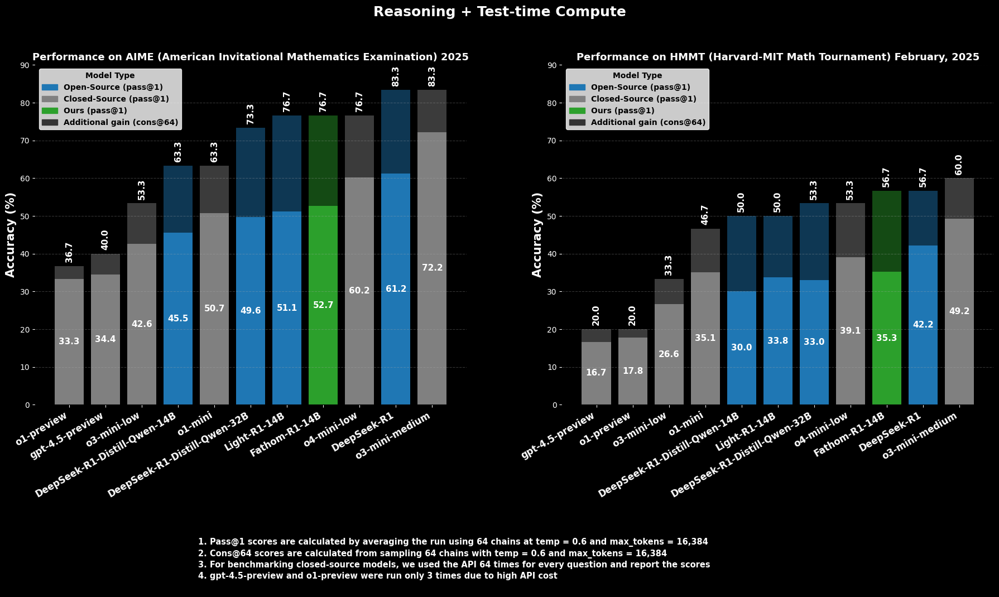

# 🧮 Ramanujan-Ganit-R1: <$999 Training Recipe for Unlocking Math Reasoning at o4-mini level using R1-distilled-14B model under 16K context


<div align="center">

[](https://huggingface.co/FractalAIResearch/Ramanujan-Ganit-R1-14B-V1)

</div>

<p align="center">        </p>
---

## Overview

We introduce **Ramanujan-Ganit-R1-14B-V1** - a compute-efficient 14B SOTA reasoning language model; finetuned from Deepseek-R1-Distilled-Qwen-14B and optimized for **mathematical reasoning**. By leveraging post-training techniques: **reinforcement learning** and **supervised fine-tuning**, in a multi-stage and cost-effective manner, we create two intermediate checkpoints with improved reasoning and certain distinct performance characteristics: **Ramanujan-Ganit-R1-14B-V0.4** and **Ramanujan-Ganit-R1-14B-V0.6**. We perform **model merging** over these two checkpoints and arrive at the final checkpoint,**Ramanujan-Ganit-R1-14B-V1**. We achieve our final checkpoint with an effective training budget of less than 999 dollars! On the latest olympiad level exams: AIME-25 and HMMT-25, our model not only **surpasses o3-mini-low, o1-mini and LightR1-14B(16k)** at pass@1 scores (averaged over 64 runs) but also delivers **performance rivaling closed-source o4-mini (low)** w.r.t cons@64 — all while staying within a **16K context window**. It achieves 51.9% Pass@1 accuracy on AIME2025 and 35.8% Pass@1 accuracy on HMMT25(+5.8% and +6.3% improvement over the base model respectively). When provided with additional test-time compute in the form of cons@64, it achieves an impressive 76.7% accuracy on AIME2025 and 56.7% accuracy on HMMT25(+13.4% and +6.7% improvement over the base model respectively). We are open-sourcing our models and training details which we believe will help the community to progress further in the reasoning domain. 

---

## 🧪 Motivation

Thinking longer during inference time has shown to unlock superior reasoning abilities and expert level performance on challenging queries and tasks.  Since the open-source release of DeepSeek R1 series models, multiple open-source efforts [s1, LIMO, add more] have focused on reproducing the results (easpecially at <=32B scale) either via distillation or RL based fine-tuning on top of non-reasoning models. Though in most cases, these efforts at best could come close to the performance R1 series models but are unable to surpass them.  Certain recent methods such as [DeepscaleR, DeepCoder, Light-R1] start with the existing reasoning models and have managed to extend the performance of these models. However, the training runs for these methods are costlier and often rely on longer sequence lengths. 

---

## 🏗️ Training Pipeline
### Training Recipe for Ramanujan-Ganit-R1-14B-v0.4

In the first training phase, we aim to instill the model with a preference for brevity without compromising correctness. The goal is to train the model to preserve only the most essential parts of the response chain, laying the groundwork for efficient reasoning in resource-constrained settings. We aim to further refine this capability by encouraging the model to elaborate its reasoning only as much as necessary — especially for solving more difficult problems. The central intuition is that a model trained on minimal yet complete reasoning chains can learn to be both precise and efficient in its explanations.

We begin by calculating solve rates for each question under a strict 6,000-token constraint by sampling multiple responses from R1-Distill-14B model. Questions whose solve rates fall between 0.0 and 0.5 are retained to form the **RL Compression dataset**. Starting from the R1-Distill-14B checkpoint, we train the model using the **GRPO algorithm**, with a modified objective function to reward shorter chains that reach the correct answer.

Once this reinforcement learning (RL) phase is complete, we build upon the RL checkpoint and continue supervised fine-tuning under a **16K context window** to encourage more detailed reasoning that would be required for solving more complex problems. For this stage, we curate a dataset consisting of hard problems — specifically, questions with solve rates between 0.1 and 0.4. Sampling multiple responses from the R1-Distill-14B model, we identify all correct response chains. This time, instead of imposing any token limit, for each question, we select the **shortest correct chain**, forming the **SFT Shortest Chains dataset**.

Through supervised fine-tuning on this dataset, the model learns to explain its reasoning in a more precise and efficient manner — elaborating only when necessary and avoiding redundant or tangential steps. The resulting model is named **Ramanujan-Ganit-R1-14B-v0.4**, optimized for concise yet accurate mathematical reasoning.


### Training Recipe for Ramanujan-Ganit-R1-14B-v0.6

This training stage focuses on improving the model’s performance on **hard mathematical problems** through a curriculum learning strategy. Curriculum learning is a well-established technique for training LLMs, where the model is progressively exposed to more difficult tasks. The idea is to build foundational understanding first and gradually scaffold more complex reasoning, thereby enhancing generalization and reducing overfitting. By first training on moderately difficult examples, the model internalizes essential reasoning patterns, enabling it to tackle harder problems with greater confidence and robustness.

We begin by annotating each question’s difficulty on a scale from **1 to 10** using **OpenAI's o3mini** model. We retain only those questions rated **5 or above**, and further filter them to include only those having **solve rates between 0.2 and 0.6**, as computed from multiple samples generated by the R1-Distill-14B model. This yields the **Curriculum Learning dataset**.

The **DeepSeek-R1-Distill-Qwen-14B** checkpoint is chosen as the base model for **supervised fine-tuning (SFT)** under a **16K context window**. A **curriculum schedule** is employed across each training epoch, such that questions are presented in order of increasing difficulty. This structured progression — from easier to harder examples — allows the model to incrementally develop and enhance its problem-solving skills.

The resulting model is **Ramanujan-Ganit-R1-14B-v0.6**, a model that demonstrates improved reasoning performance on challenging mathematical problems.


## Model Merging
The final model, **Ramanujan-Ganit-R1-14B-V1**, is obtained by **merging** the 2 reasoning models obtained via aforementioned training stages:

- **Ramanujan-Ganit-R1-14B-V0.4 (RL + SFT)**: This checkpoint during our internal evaluations gave higher pass@k and also contributes the ability to generate relatively efficient reasoning chains while improving the accuracy over the baseline.
- **Ramanujan-Ganit-R1-14B-V0.6 (Iterative Curriculum SFT)** This checkpoint obtained higher maj@k scores and hence had less variability over multiple runs.
  
By combining these complementary strengths of the 2 models, **Ramanujan-Ganit-R1-14B-V1** maximizes its potential of solving highly complicated math problems accurately, while simultaneously offering a **concise explanation** for the same.

## 💰 Training Cost

We developed **Ramanujan-Ganit-R1-14B-V1** using a focused, resource-efficient strategy that balances performance with compute budget. Below is the GPU time utilized and the cost incurred

| Training Method            | GPU Hours (H100) | Cost(USD) |
|----------------------------|------------------|------|
| Ramanujan-Ganit-R1-14B-V0.4     | 293         |    831  |
| Ramanujan-Ganit-R1-14B-V0.6     | 48         |    136  |
| **Total**   | **341**     |    967  |

So, the final Ramanujan-Ganit-R1-14B-V1 took just 967$ to be trained overall! This low training cost highlights the efficiency of our method — enabling high-level mathematical reasoning comparable to **o4-mini** in under **999USD** , all within a **16k context budget**.

## 📊 Evaluation
We evaluate Ramanujan-Ganit‑R1-14B-V1 using the same metrics and sampling configuration introduced in the DeepSeek‑R1 paper, namely **pass@1** and **cons@64**. However, our evaluation is conducted under a reduced output budget of 16,384 tokens, compared to DeepSeek‑R1’s 32,768 tokens, to better reflect practical deployment constraints.

- **pass@1**: Measures the fraction of problems correctly solved in the first generated sample.
- **cons@64**: Assesses consistency by sampling 64 reasoning chains per question and computing the majority vote accuracy.

**Evaluation Configuration**:

- Temperature: 0.6  
- top_p: 0.95  
- Number of sampled chains: 64  
- Context: 16,384 tokens  

This setup allows us to benchmark Ramanujan-Ganit-R1-14B‑V1’s reasoning performance and stability under realistic memory and inference budgets, while maintaining compatibility with the DeepSeek‑R1 evaluation protocol.

We utilize the evaluation framework provided by the [LIMO](https://github.com/GAIR-NLP/LIMO) repository to run inference and compute metrics.
For detailed instructions and implementation details, please refer to [`eval/README.md`](./eval/readme.md).


## Results
We evaluate and compare **Ramanujan-Ganit‑R1-14B-V1** with several baseline models across 3 challenging benchmarks:  **AIME25**, **HMMT25**, and **GPQA**. For each, we report `pass@1` and `cons@64`, following the same evaluation configuration.

| Model            | AIME25         |               | HMMT25         |               |
|------------------|----------------|---------------|----------------|---------------|
|                  | pass@1         | cons@64       | pass@1         | cons@64       |
| **Closed-Source Models**               |                |               |                |               |
| o1‑mini          | 50.71          | 63.33         | 35.15          | 46.67         |
| o3‑mini‑low      | 42.6           | 53.33         | 26.61          | 33.33         |
| o3‑mini‑medium   | 72.24          | 83.33         | 49.21          | 60.00         |
| o4-mini-low      | 60.2           | 76.67         | 39.11          | 53.33         |
| o1‑preview       | 33.33          | 36.67         | 17.78          | 20.00         |
| gpt‑4.5‑preview  | 34.44          | 40.00         | 16.67          | 20.00         |
| **Open-Source Models**               |                |               |                |               |
| LightR1‑14B      | 51.15          | 76.67         | 34.11          | 50.00         |
|  DeepSeek-R1-Distill-Qwen-14B   | 45.5           | 63.33         | 30.00          | 50.00         |
|  DeepSeek-R1-Distill-Qwen-32B   | 49.64          | 73.33         | 33.02          | 53.33         |
| DeepSeekR1‑670B          | 61.25          | 83.33         | 42.19          | 56.67         |
| Ramanujan-Ganit‑R1-14B-V0.4         | 50.94          | 73.33         | 33.7           | 40.00         |
| Ramanujan-Ganit‑R1-14B-V0.6          | 50.63          | 76.67         | 32.19          | 50.00         |
| **Ramanujan-Ganit‑R1-14B-V1** | **51.88**      | **76.67**     | **35.78**      | **56.66**     |

**Ramanujan-Ganit‑R1-14B-V1** demonstrates highly competitive performance across all datasets, improving over the original R1-distilled models while closely matching or surpassing other strong baselines in several settings. 
On both AIME 25 and HMMT 25, our model shows the highest pass@1 as well as cons@64 scores among all the open-source models (including the bigger R1-Distilled-32B model), with R1-670B being the only exception.

In fact, we observe that Ramanujan-Ganit-R1-14B-V1 is superior to the first two mini-class generations of OpenAI reasoning models, including **o1-mini** and **o3-mini (low)** and it's performance closely matches that of newly released **o4-mini (low)**.
Its consistency across diverse mathematical domains highlights its balanced reasoning ability.

---

## 🌍 Generalization Beyond Math: GPQA-Diamond

Notably, we also observe out-of-domain improvement in **GPQA-Diamond**, even though there wasn't a single instance of non-math questions in our training data. 
This indicates that our training methodology mentioned above and training on math wuestions facilitates generalization across diverse domains, a finding similar to what LightR1-14B & LIMO had observed.
#### ✅ GPQA Benchmark Comparison (16k)
| **Model**         | **pass@1** | **cons@64** |
|-------------------|------------|-------------|
|  DeepSeek-R1-Distill-Qwen-14B    | 54.19      | 64.14       |
| LightR1‑14B       | 56.94      | 65.15       |
| Ramanujan-Ganit‑R1-14B-V0.4           | 56.35      | 66.67       |
| Ramanujan-Ganit‑R1-14B-V0.6           | 58.91      | 63.13       |
| **Ramanujan-Ganit‑R1-14B-V1**  | **59.13** | **66.16**  |

## ✂️ Ablation Study on Token Efficiency
To assess reasoning token efficiency, we compare the **average response token count**, under 16k context length, across  AIME25, and HMMT25. On AIME25, Ramanujan-Ganit‑R1-14B-V1 uses 10% fewer response tokens than LightR1-14B despite having higher pass@1. HMMT25 questions are relatively tougher compared to AIME'25 and tougher questions usually require more thinking tokens. On HMMT25, Ramanujan-Ganit‑R1-14B-V1 uses 4.5% fewer response tokens than LightR1-14B despite having higher pass@1. 

#### Average Response Length (Tokens)

| Model            | AIME25 | HMMT25 |
|------------------|--------|--------|
| LightR1-14B         | 11330  | 12680  |
|  DeepSeek-R1-Distill-Qwen-14B   | 10878  | 12263  |
| Ramanujan-Ganit‑R1-14B-V0.4          | 10570  | 11950  |
| Ramanujan-Ganit‑R1-14B-V0.6         | 11236  | 12717  |
| **Ramanujan-Ganit‑R1-14B-V1**      | **10083**  | **12100**  |

## Data Decontimination

Both benchmarks used (AIME 25 and HMMT 25) were released a few weeks after the release of the base model, ensuring no contamination occurred during the model's pre-training. The dataset corpora (Numina-Math 1.5 & OpenR1-Math) were released around the same time as these exams, with a cutoff date no later than 2024. Additionally, we conduct checks to verify there is no contamination in the training data.

## 📜 License

Our project is available under the MIT License, underscoring our dedication to open and inclusive AI innovation. By freely sharing our work, we aim to democratize AI technology, empowering researchers, developers, and enthusiasts everywhere to use, adapt, and expand upon it without limitation. This open and permissive approach promotes global collaboration, accelerates innovation, and enriches the AI community as a whole.

## Acknowledgments
We would like to acknowledge the following works for enabling our project:
- DeepseekR1 distill qwen 14b
- NuminaMath 1.5
- OpenR1-Math
- 360LLAMA factory
- verl
- LIMO

---

## 📖 Citation

```bibtex
@misc{ganit14b2025,
  title={Ramanujan-Ganit-R1: <$799 Training Recipe for Unlocking Math Reasoning at o4-mini level using R1-distill-14B model under 16K context},
  author={Kunal Singh and Pradeep Moturi and Ankan Biswas and Siva Gollapalli and Sayandeep Bhowmick},
  howpublished={\url{https://huggingface.co/FractalAIResearch/Ramanujan-Ganit-R1-14B-V1}},
  note={Hugging Face},
  year={2025}
}
```


## About Project Ramanujan

We initiated Project Ramanujan approximately one year ago, aiming to unlock intelligence and enhance AI agents by pushing the boundaries of advanced reasoning. Our key accomplishments include:
- ICLR'25 & NeurIPS'24-MATH-AI: [SBSC: Step-By-Step Coding for Improving Mathematical Olympiad Performance](https://arxiv.org/abs/2502.16666)
- Winners of HackerCupAI@NeurIPS'24 & ICLR'25-VerifAI: [Stress Testing Based Self-Consistency For Olympiad Programming](https://openreview.net/forum?id=7SlCSjhBsq)
- CVPR'25-MULA: [TRISHUL: Towards Region Identification and Screen Hierarchy Understanding for Large VLM based GUI Agents
](https://arxiv.org/abs/2502.08226))
- Silver Medal in AIMO'24
